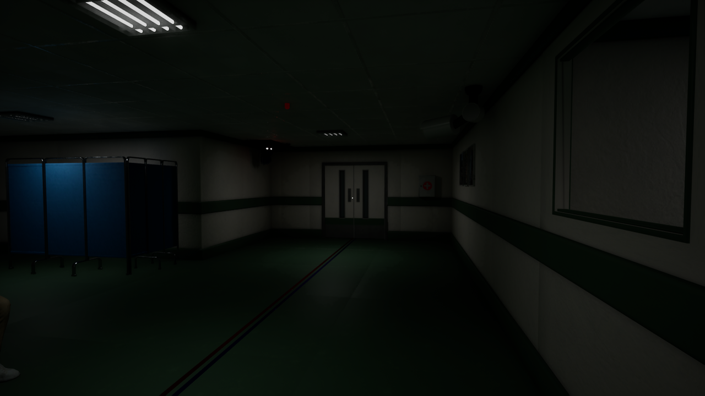
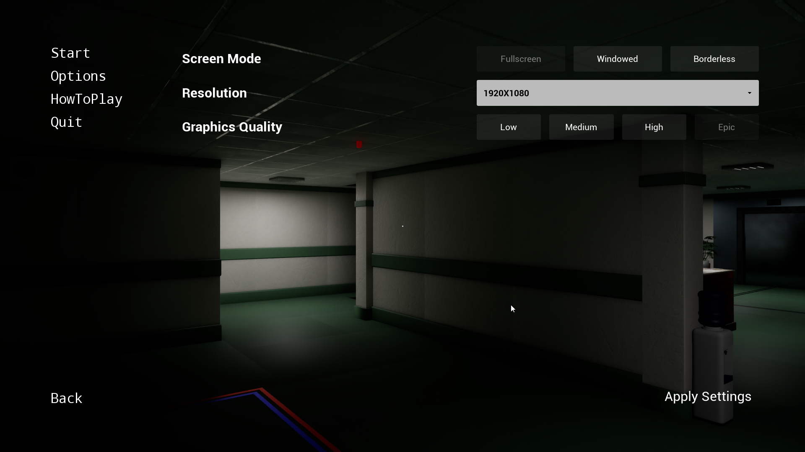
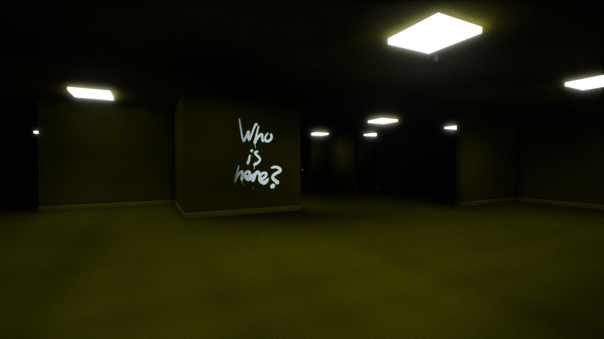

# Základní koncepce
## **Anomali Hospital** | Pavel Ringelhán | p.ring@gmail.com

**Tým**:  
 *Level Design* – Pavel Ringelhán  
 *Development* – Josef Sivčo, Pavel Ringelhán  
 *2D Art* – Adriana Tesařová  
 *3D Modeling* – Mgr. Matěj Brunovský    
 *Dabing* – externí dabéři

**Žánr:** Logický horor, Anomaly  
**Grafika:** 3D, pohled z první osoby, realistické zpracování, důraz na světlo a stíny  
**Technologie:** Unreal Engine 5.7 (Blueprint System), Blender, 3Ds Max, Adobe Audacity  
**Platforma:** PC (Windows)  
**Cílové publikum:** hráči hororů a logických her  
**Záměr:** Komerční  
**Licence:** Zakoupené pro všechny externí assety, zvuky..

**Inspirace**: [https://store.steampowered.com/app/2653790/The\_Exit\_8/](https://store.steampowered.com/app/2653790/The_Exit_8/)

**Koncept hry:**  
 Hráč se pohybuje v uzavřeném 3D prostředí nemocnice. V prvním levelu si musí zapamatovat rozmístění objektů a prostředí. V dalších úrovních zjišťuje, zda došlo k „anomáliím“ — změnám v prostředí, novým nebo chybějícím objektům. Správné odhalení posouvá hráče dál.

  
  

*(Pouze ukázkový příklad)*

Hráče během celé hry provází kombinace hororových a zároveň zábavných anomálií, které vytvářejí napjatou, ale zároveň poutavou atmosféru. Každý level představuje unikátní logickou výzvu zasazenou do různých prostředí, například stylizovaných lokací inspirovaných konceptem *Backrooms*. Prostředí se dynamicky mění, objevují se nové objekty, vizuální efekty a zvukové vjemy, které testují hráčovu pozornost a schopnost rozeznat i ty nejmenší odchylky od normálu.

 
 
*(Pouze ukázkový příklad)*  
